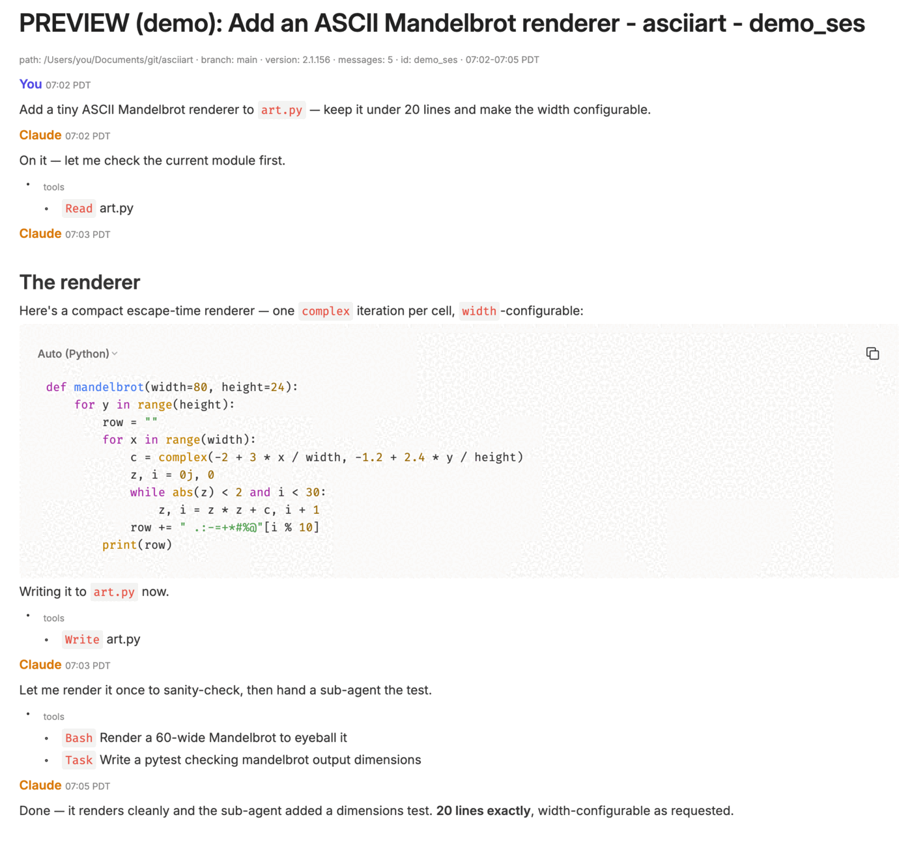

# claude-evernote-sync

[](https://github.com/brooksomics/claude-evernote-sync/actions/workflows/ci.yml)
[](./LICENSE)
[](https://www.python.org/downloads/)

Automatically sync [Claude Code](https://claude.com/claude-code) CLI conversations to Evernote as one note per session, titled by topic.

Each Claude Code session becomes a separate Evernote note. The note title is derived from the session's auto-generated summary (or first user prompt as fallback) so the list view actually tells you what each note is about. Long-running sessions append to the same note hourly rather than fragmenting across many.

## Why this exists

Claude Code stores every conversation as a JSONL file under `~/.claude/projects/`, but there's no built-in way to archive them outside that directory. If you want to keep a searchable record of what you've worked on, you're stuck copy-pasting transcripts into your knowledge base. This tool automates that for Evernote users.

## Backends

Pick one in `config.toml`:

| Backend | Status | What it does |
|---|---|---|
| `email` (default) | **Works today** | Uses Evernote's [email-to-note](https://help.evernote.com/hc/en-us/articles/209005347-Save-emails-into-Evernote) feature. Requires a Gmail account + app password. Append-only — each hourly run sends only new messages. |
| `api` | **Blocked** | Uses Evernote's NoteStore API. Evernote [suspended new developer-token issuance](https://discussion.evernote.com/forums/topic/156356-api-key-requests-suspended/) in Jan 2026. Code is ready; activate when EN reopens access. |
| `mcp` | **Future** | Evernote has announced an upcoming [MCP integration](https://evernote.com/mcp). Will be added here when it ships. |

## Quick start (email backend)

### Prerequisites

- macOS (other Unix-likes should work but launchd is Mac-specific)
- Python 3.13+ and [`uv`](https://github.com/astral-sh/uv)
- A Gmail account with an [App Password](https://myaccount.google.com/apppasswords)
- An Evernote account on any plan (Free, Starter, or Advanced) — the [email-to-note](https://help.evernote.com/hc/en-us/articles/209005347-Save-emails-into-Evernote) feature works on all of them

### 1. Clone + install

```bash
git clone https://github.com/<you>/claude-evernote-sync.git
cd claude-evernote-sync
uv sync
```

### 2. Find your Evernote email-to-note address

In Evernote: **Account → Account Info → Email Notes to**. It looks like `username.xxx@m.evernote.com`. Treat it like a password — anyone who has it can email content into your account.

### 2a. Create the destination notebooks in Evernote

The default config (`config.toml.example`) ships with `notebook_prefix = "convos_"` — every session routes to a notebook named `convos_<bucket>` (e.g. `convos_myapp`, `convos_personal-blog`). One notebook per project keeps the sidebar tidy when you collect them in a stack.

**Easiest setup:**

1. In Evernote, create a stack named something like `claude_convos` (right-click any notebook → *Add to stack* → *New stack*).
2. Run a dry-run to discover which buckets will be used:
   ```bash
   uv run claude-evernote-sync --dry-run -v
   ```
   The output lines (`[dry-run] would sync: <title> - <bucket> - <short_id>`) tell you the bucket name for each session.
3. Create a notebook for each unique bucket inside the stack, named `convos_<bucket>`. Also create the catch-all `convos_default` notebook for any session whose bucket can't be derived.

If you'd rather route everything to a single notebook, set `notebook_prefix = ""` and use `notebook_name` as your single target.

This step matters because Evernote's email-to-note feature **silently falls back to your default notebook** if the `@notebook` reference doesn't exist or has a typo — notes won't be lost, but they'll land in the wrong place and you'll have to move them manually. The `api` backend creates notebooks automatically; the `email` backend cannot.

### 3. Configure

```bash
mkdir -p ~/.claude-evernote-sync
cp config.toml.example ~/.claude-evernote-sync/config.toml
cp credentials.json.example ~/.claude-evernote-sync/credentials.json
chmod 600 ~/.claude-evernote-sync/credentials.json
```

Edit `~/.claude-evernote-sync/credentials.json` and fill in your Gmail sender, app password, and Evernote email address.

### 4. Dry-run

Confirm what would be synced without touching Evernote:

```bash
uv run claude-evernote-sync --dry-run -v
```

You should see lines like:

```
found 44 JSONL files within 2 days
parsed 44 sessions
[dry-run] would sync: Refactor user auth - myrepo - abc12345 (37 msgs)
[dry-run] would sync: Help me debug deploy pipeline - tile-ai - def67890 (12 msgs)
```

If the topics and buckets look right, proceed.

### 5. First real sync

```bash
uv run claude-evernote-sync -v             # last 2 days
uv run claude-evernote-sync --backfill -v  # everything (initial bulk import)
```

### 6. Schedule hourly via launchd

```bash
./scripts/install-launchd.sh
```

This script installs a `com.claudeevernote.sync` LaunchAgent that runs the sync hourly. It substitutes your local paths into a template — no hardcoded usernames.

Useful commands:

```bash
launchctl start com.claudeevernote.sync     # force a run now
launchctl list | grep claudeevernote        # check status
launchctl unload ~/Library/LaunchAgents/com.claudeevernote.sync.plist
rm ~/Library/LaunchAgents/com.claudeevernote.sync.plist  # uninstall
```

## What gets synced

For each Claude Code session JSONL:

- **Included**: user prompts, assistant responses (including any code they write), and — at `content_depth = "full"` (the default) — a compact list of the tool calls the assistant made (Bash, Read, Edit, Task, …). Plus session metadata (project path, git branch, version, message count).
- **Excluded**: tool *output* (command stdout, file contents) and thinking blocks. Set `content_depth = "conversation"` to drop the tool-call lines too.

Each session becomes one note. The note title has the form `<topic> - <bucket> - <short_id>`, where:

- **topic** is the session's embedded summary/title (Claude Code writes these into the JSONL automatically), falling back to the first user prompt if no summary exists yet, then to the literal "Claude Session". Sub-agent transcripts (under `subagents/`) are titled from their task description instead — see [`subagent_notes`](#render-options-render)
- **bucket** is:
  1. The configured override path's basename if `cwd` is under one (see `rollup_overrides`)
  2. Else, the git repo root's basename
  3. Else, the immediate directory's basename
- **short_id** is the first 8 characters of the session UUID, so identical topics in the same bucket still produce distinct notes

## What a note looks like

Notes are rendered for skimmability, not as a raw dump: a small gray metadata line, then the conversation with **You** / **Claude** role labels (colored), minute-precision timestamps, code blocks, and — at `content_depth = "full"` — a compact, foldable list of the tool calls each turn made. The Evernote apps layer on more automatically: code blocks become **syntax-highlighted code widgets** with a copy button, and the assistant's markdown headings populate the note's **table of contents** and collapsible sections.

Here's that demo session rendered in the Evernote desktop app. The fixture (`tests/fixtures/demo_session.jsonl`) is pinned by `tests/test_showcase.py`, and you can reproduce the note yourself with `uv run python scripts/preview_render.py --demo`:



Colors, the code-widget syntax highlighting, and heading-based folding/TOC are Evernote-app rendering; the stored note is plain inline-styled HTML.

## Configuration reference

See [`config.toml.example`](./config.toml.example) for all options. Key fields:

```toml
[evernote]
backend = "email"               # "email" or "api"
notebook_prefix = "convos_"     # every session routes to "<prefix><bucket>"
notebook_name = "convos_default" # catch-all (used only when prefix is empty)
developer_token = ""            # required for backend = "api"

[scan]
projects_dir = "~/.claude/projects"
days_back = 2
quiet_minutes = 15        # hold back sessions active in the last N minutes (0 = off)

[render]
subagent_notes = "keep"   # "keep" = title sub-agent notes from .meta.json; "suppress" = skip them
content_depth = "full"    # "full" = dialogue + compact tool-call lines; "conversation" = dialogue only

[grouping]
rollup_overrides = ["/path/to/workspace"]  # absorb child repos

[notebook_overrides]
# "myapp" = "Special Notebook Name"   # explicit override; never re-prefixed
# personal_blog = "Writing"
```

### Per-bucket notebook routing

Two layered mechanisms decide which Evernote notebook a session lands in:

1. **`notebook_overrides`** — explicit per-bucket mapping. Wins over everything else. The value is used verbatim (not re-prefixed).
2. **`notebook_prefix`** — if set, any bucket *not* in `notebook_overrides` routes to `<prefix><bucket>`. This is the recommended default — one notebook per project, kept tidy under a stack.
3. **`notebook_name`** — final fallback. Used only when `notebook_prefix` is empty.

Keys in `notebook_overrides` are bucket names (= git repo root's basename, or `rollup_overrides` path basename).

**Important:** with the `email` backend you must create each referenced notebook in Evernote manually before first sync. Email-to-note's `@notebook` syntax silently routes to your default notebook if the target doesn't exist. The `api` backend auto-creates notebooks.

### Render options (`[render]`)

- **`subagent_notes`** — Claude Code sub-agent (Task-tool) transcripts live under `<session>/subagents/`. `"keep"` (default) gives each its own note titled from its `.meta.json` task description (e.g. *"Audit pooling and perf hotspots"*); `"suppress"` skips them so only top-level sessions sync.
- **`content_depth`** — `"full"` (default) includes a compact, foldable list of the assistant's tool calls; `"conversation"` renders just the dialogue. Code the assistant writes renders either way.

## CLI reference

```
claude-evernote-sync [--config PATH] [--dry-run] [--days N] [--limit N] [--force] [--backfill] [-v]
```

| Flag | Default | Effect |
|---|---|---|
| `--config PATH` | `~/.claude-evernote-sync/config.toml` | Config file location |
| `--dry-run` | off | Print what would be synced; no Evernote calls |
| `--days N` | from config | Override `days_back` for this run |
| `--limit N` | unlimited | Keep at most N most-recently-active sessions (useful for verifying rendering with a small sample) |
| `--force` | off | Re-send all messages for matched sessions; clears their per-session state first. Existing Evernote notes are not modified — a force run creates a fresh per-session note, so delete the prior note in Evernote first if you don't want a duplicate. |
| `--backfill` | off | Sync everything (sets `days_back=3650`) |
| `-v` | off | Verbose logging |

## How the "growing note" pattern works (email backend)

State lives in `~/.claude-evernote-sync/sync_state.json` — one record per session containing the set of message UUIDs that have already been emailed plus the title that was locked at first sync. Each hourly run:

1. Walks all Claude Code sessions whose JSONL files were modified in the last `days_back` days
2. For each session, finds messages whose UUIDs aren't in that session's record
3. If the session has never been synced: derives a title, sends a **create** email (`Subject @Notebook`) with the full session content, and stores the title in state
4. Otherwise: sends an **append** email (`Subject @Notebook +`) with only the new messages, reusing the stored title so the subject matches
5. Marks those UUIDs as synced under that session's record

Evernote's email-to-note rule for append: a `+` at the end of the subject line tells Evernote to append the body to the most recent note matching the title before the `+`. So the title is locked at first sync (kept in state) — later JSONL summary updates do not retitle the existing note, because the subject is also the matching key.

### Known limitation: appends can silently duplicate

Append-by-title is best-effort on Evernote's side, and SMTP gives no feedback channel — a send that "succeeds" may still land wrong. When Evernote can't match **or can't modify** the target note, it silently creates a *new* note with the same title instead of appending. Known triggers:

- The target note is **open in any Evernote client** at delivery time (open notes are locked against email updates)
- Sync/title-match races on Evernote's servers
- Manual renames of the auto-generated note (the locked title in state no longer matches)

The `quiet_minutes` setting (default 15) reduces exposure: a session isn't synced until it's been idle that long, so most sessions go out as a single create email and append sends become rare. Appends still happen when a session resumes after a long gap, so duplicates can't be ruled out entirely.

**Recovery when it happens:** merge the two notes manually in Evernote (copy the newer note's body to the end of the original, then delete the newer one). Note that until you do, *future* appends follow the most recent note with that title — i.e. the conversation continues in the duplicate, so nothing is lost.

### State file size

The state file (`sync_state.json`) grows by roughly:

| Use level | Messages/year | Growth/year |
|---|---|---|
| Light (~50 msgs/day) | ~18k | ~1 MB |
| Heavy (~500 msgs/day) | ~180k | ~9 MB |

A decade of heavy use lands around 90 MB — well under any practical concern, and parse time stays sub-second on modern SSDs.

**The state file is safe to delete at any time**, but be aware of one caveat: after deletion the next sync will treat every session in the lookback window as a first sync and send `CREATE` emails. If matching notes already exist in Evernote (because they were synced previously), email-to-note will create **duplicate notes** alongside them rather than appending. To avoid duplicates after a state reset:

- Delete the affected notes in Evernote before re-syncing, OR
- Limit the re-sync to brand-new content with `--days 1 --limit 1` so only one or two sessions touch Evernote at a time

There is no automatic pruning. If state growth ever becomes an actual problem, you can `rm ~/.claude-evernote-sync/sync_state.json` and accept the duplicate-note tradeoff for any re-synced historical sessions.

## Files written

- `~/.claude-evernote-sync/config.toml` — your config (no secrets)
- `~/.claude-evernote-sync/credentials.json` — Gmail + Evernote email (chmod 600; **gitignored**)
- `~/.claude-evernote-sync/sync_state.json` — synced UUIDs and locked title per session
- `~/.claude-evernote-sync/sync.log` — application log
- `~/.claude-evernote-sync/launchd.out.log` — launchd stdout
- `~/.claude-evernote-sync/launchd.err.log` — launchd stderr

## Privacy / data flow

For the `email` backend:

1. Your script reads JSONL files from `~/.claude/projects/`
2. Formats messages locally on your Mac
3. Sends via SMTP to `smtp.gmail.com:465` (Gmail handles delivery to Evernote)
4. Evernote receives the email, files it under the specified notebook

Your conversations transit Gmail's servers en route to Evernote. If you'd rather avoid that, the `api` backend (when unblocked) sends directly to Evernote without an SMTP middleman.

## Troubleshooting

**`Config not found`** — Copy `config.toml.example` to `~/.claude-evernote-sync/config.toml`.

**`Credentials not found`** — Copy `credentials.json.example` to `~/.claude-evernote-sync/credentials.json` and fill it in. Don't forget `chmod 600`.

**`SMTPAuthenticationError`** — Wrong Gmail app password. Generate a new one at https://myaccount.google.com/apppasswords (you'll need 2FA enabled on the Google account).

**Email arrives but no note appears in Evernote** — Check that the sender address matches what Evernote has on file for your account. Email-to-note rejects from unknown senders.

**Notes land in my default Evernote notebook instead of the intended one** — The target notebook doesn't exist (or there's a typo). Re-check the bucket name with `--dry-run -v`, confirm a matching notebook exists in Evernote (e.g. `convos_myapp` for bucket `myapp` when `notebook_prefix = "convos_"`), then move the stray notes into it. Future syncs will land correctly.

**Notes don't append, new ones get created instead** — The append `+` syntax requires an exact title match. Don't manually rename the auto-generated notes. Also: a note that's currently open in the Evernote app is locked against email updates, so the append silently becomes a duplicate note. See [Known limitation: appends can silently duplicate](#known-limitation-appends-can-silently-duplicate) for why this happens and how to recover.

**`backend='api' requires evernote.developer_token`** — You've selected the `api` backend in config but haven't pasted a developer token. Evernote API requests are currently suspended (Jan 2026 onward); use `backend = "email"` instead.

## Roadmap

- **MCP backend** when [Evernote's MCP](https://evernote.com/mcp) ships
- **Direct API backend** auto-enabled if Evernote reopens developer-token issuance

## Development

See [CONTRIBUTING.md](./CONTRIBUTING.md) for the full setup. Quick version:

```bash
git clone https://github.com/brooksomics/claude-evernote-sync.git
cd claude-evernote-sync
uv sync
pre-commit install               # installs the git hook
uv run pytest                    # full suite, coverage report
```

**Enforced by CI** (a PR fails if any of these break):
- 80% branch coverage (min)
- Strict mypy, ruff lint, ruff format (incl. 100-char line length)
- Secret scanning via `gitleaks` (every commit + CI build)

**Conventions** (followed by hand and in review; not yet auto-enforced — tracked in the issue tracker):
- 20 lines per function, 3 params per function, 2 nesting levels
- 200 lines per file, 10 functions per file

## Security

See [SECURITY.md](./SECURITY.md) for the threat model and how to report a vulnerability.

## License

MIT. See [LICENSE](./LICENSE).
